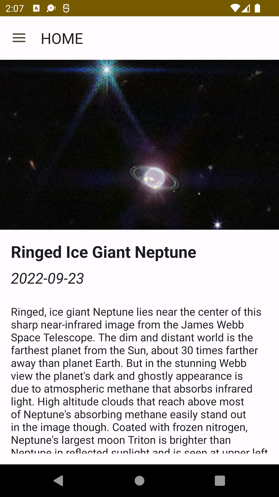
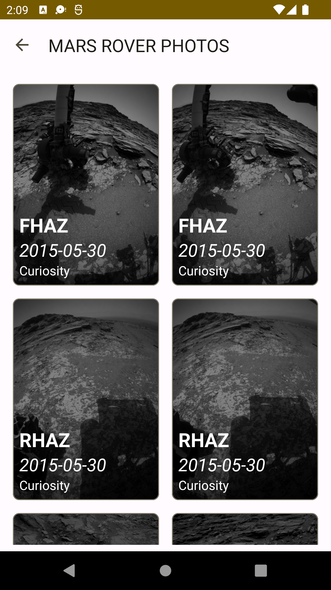
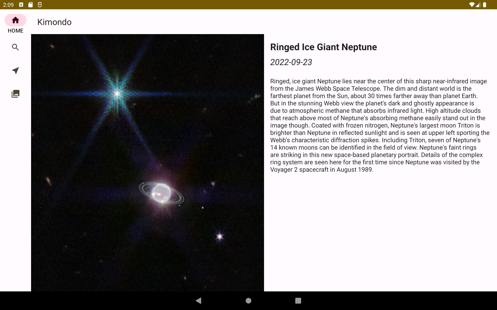
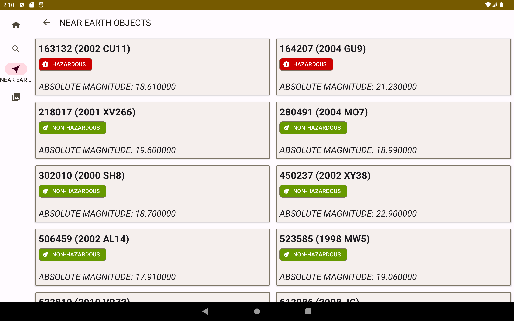
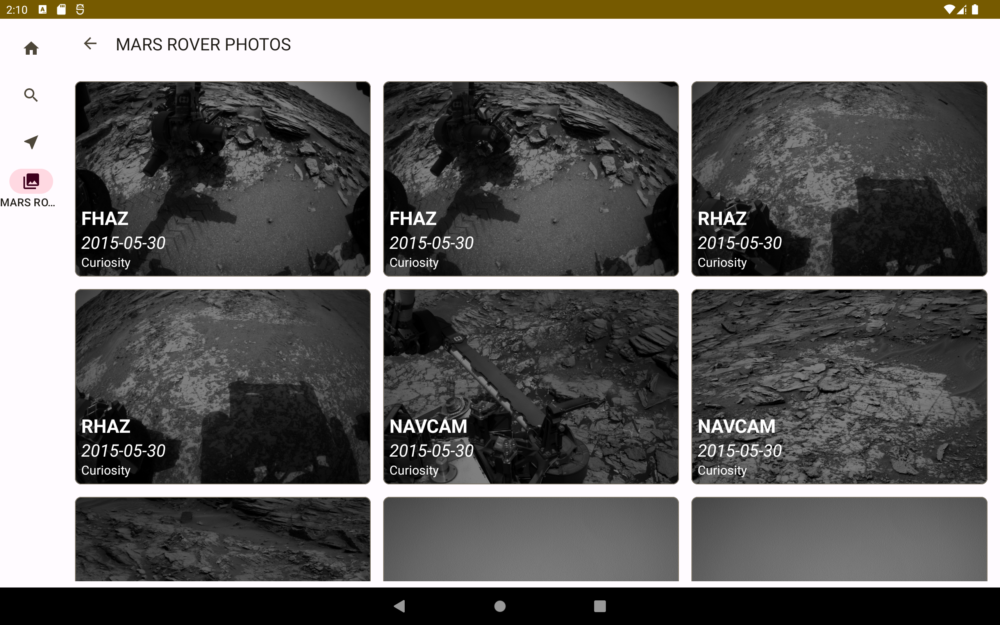

# Kimondo
Kimondo is an App for ASTRONOMY enthusiasts.
The app contains information about space.
The app was built on top of the [NASA API](https://api.nasa.gov/).

## Tools
The application has been built using the following:

* The application has been built with the following:

    * [Kotlin](https://kotlinlang.org/)
    * [Coroutines](https://kotlinlang.org/docs/reference/coroutines-overview.html)
    * [Flow](https://kotlinlang.org/docs/reference/coroutines/flow.html)
    * [Jetpack](https://developer.android.com/jetpack)
        * [Lifecycle](https://developer.android.com/topic/libraries/architecture/lifecycle)
        * [ViewModel](https://developer.android.com/topic/libraries/architecture/viewmodel)
        * [WorkManager](https://developer.android.com/topic/libraries/architecture/workmanager/basics)
        * [Room](https://developer.android.com/training/data-storage/room)
    * [Koin](https://insert-koin.io/)

* Architecture
    * App Architecture - MVVM + Clean Architecture

* Tests
    * [JUnit5](https://junit.org/junit5/)
    * [espresso](https://developer.android.com/training/testing/espresso)

## Screenshots
Take a peek at what am working on:

* PHONE

HOME | NEO PAGE | ROVER PHOTOS |
---- | -------- | ------------ |
 |  |  |

* TABLET

HOME | NEO PAGE | ROVER PHOTOS |
---- | -------- | ------------ |
 |  |  |

## LICENSE
This project is distributed under Apache License 2.0